<p align="center">
  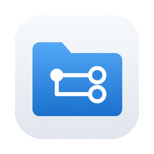
</p>

<h1 align="center">가지런 (Gajireon)</h1>

<p align="center">
  <b>로컬에서 파일을 '다른 이름으로 저장'하는 경우, '원본-파생본' 관계를 알 수 있도록 폴더구조를 정리 해주는 macOS 앱</b><br><br>
  <a href="https://github.com/SukheeChoi/Gajireon/releases/latest/download/Gajireon.dmg">⬇︎ 다운로드 (dmg)</a>
</p>

## 문제 발견

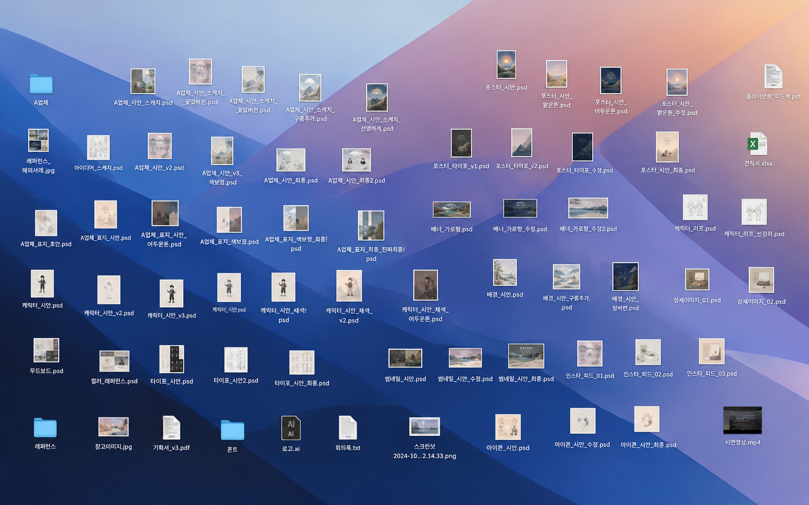

친구의 어지러운 바탕화면(사진은 예시)에서 시작한 작업이다.

일러스트 디자인 작업처럼 하나의 파일에서 여러 버전의 작업물을 파생하는 경우, 작업물의 파생관계를 '파일명'으로 유추해야 하는 불편함을 없애고자 했다.

파일들의 파생관계가 (위)와 같다면, '다른 이름으로 저장'시에 (아래)처럼 원본 파일명으로 폴더를 만들어서 정리해준다.

```
A업체_시안_스케치.psd                      원본
├─ A업체_시안_스케치_꽃있버전.psd             파생본
│  └─ A업체_시안_스케치_꽃있버전_구름추가.psd   꽃있버전의 파생본
├─ A업체_시안_스케치_꽃없버전.psd             파생본
└─ A업체_시안_스케치_선명하게.psd             파생본
```

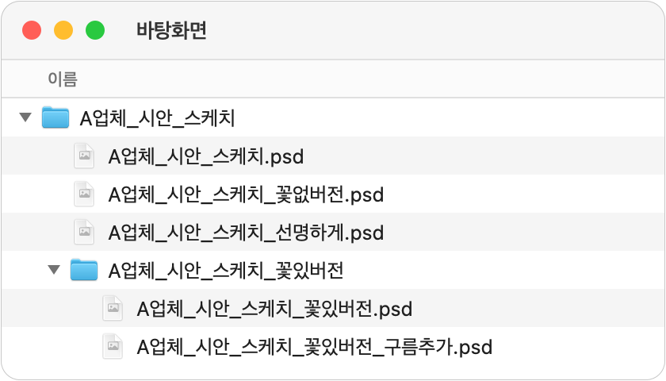

---

## 해결

그래서 "'**다른 이름으로 저장**'할 때마다 알아서 '원본-파생본'관계대로 파일정리 해주는 어플리케이션"을 만들었다.
사용자는 가지런을 켠 상태로 평소대로 '다른 이름으로 저장'해서 작업물을 만들면 알아서 정리된다.

---

## 사용법

> [!NOTE]
> 정식 배포 앱이 아니어서 다음 절차가 필요할 수 있다.
>
> - **시스템 설정 > 개인정보 보호 및 보안** > "'Gajireon'이(가) 확인된 개발자의 앱이 아니므로 차단되었습니다" 옆에 **[그래도 열기]** 버튼 클릭

1. dmg파일로 설치. 아이콘 Applications로 드래그-드롭

   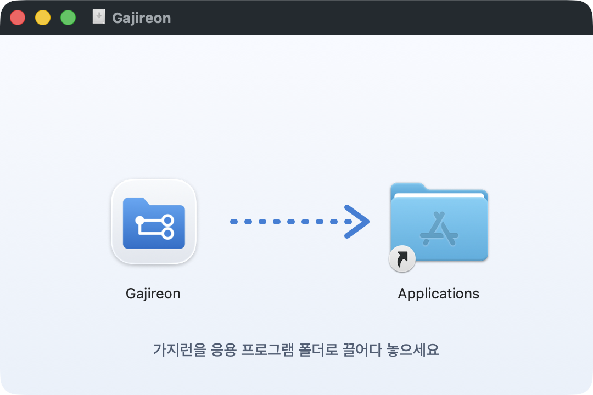

2. 시작하기 3단계
<sub>1단계</sub>
   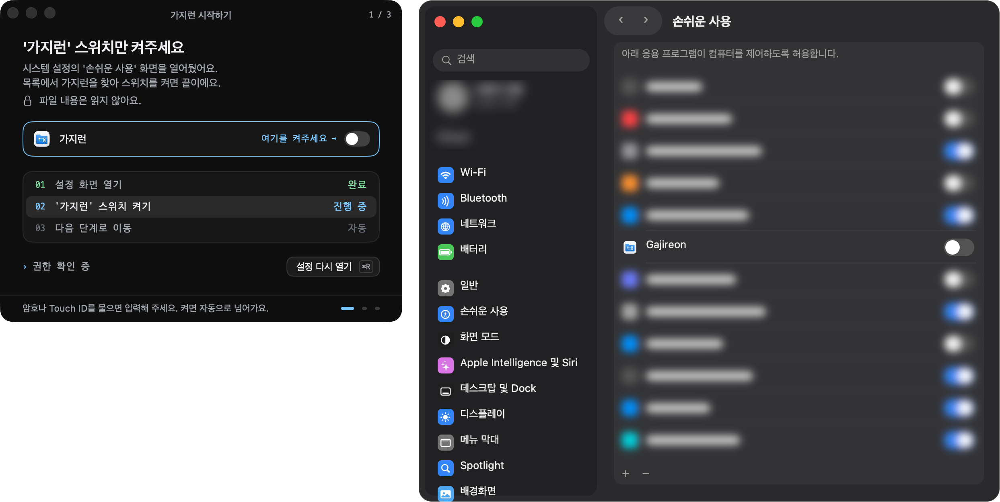<br>
   <sub>2단계</sub>

   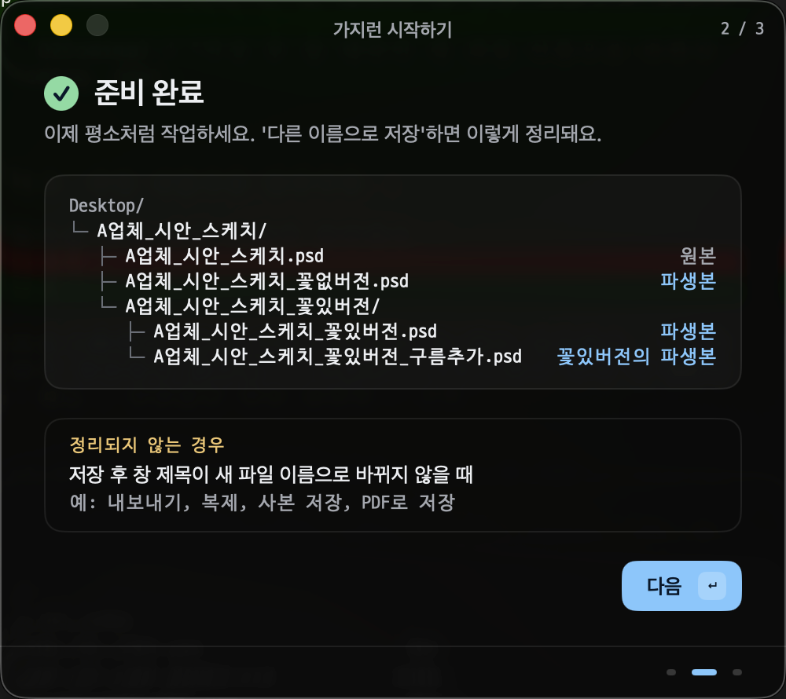<br>
   <sub>3단계</sub>

   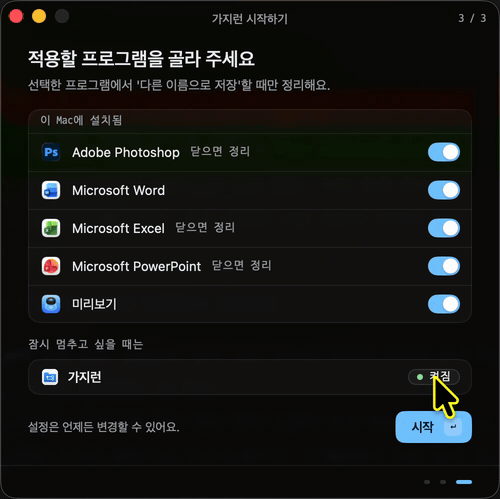<br>

끝! 평소처럼 작업하고 **다른 이름으로 저장**하면 된다.

---

## 세부기능

가지런이 제공하는 세부기능은 다음과 같다.

가지런이 파일을 정리하면 토스트 제공. 정리한 **폴더 열기**, 정리 전 경로로 **되돌리기**.


 메뉴바에서 패널창으로 간단한 기능을 제공한다.

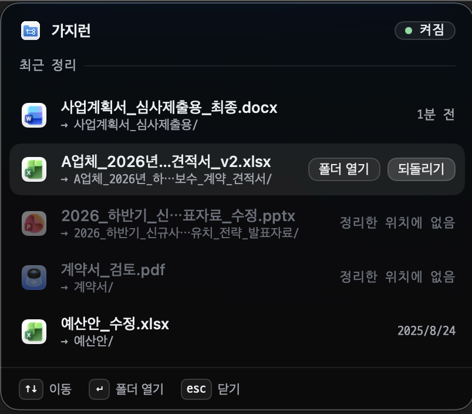

<details>
<summary><b>어플리케이션 창 > 최근정리</b></summary>

<p>폴더열기, 되돌리기 지원.<br>
되돌릴 수 없는 경우는 안내한다.</p>

<p>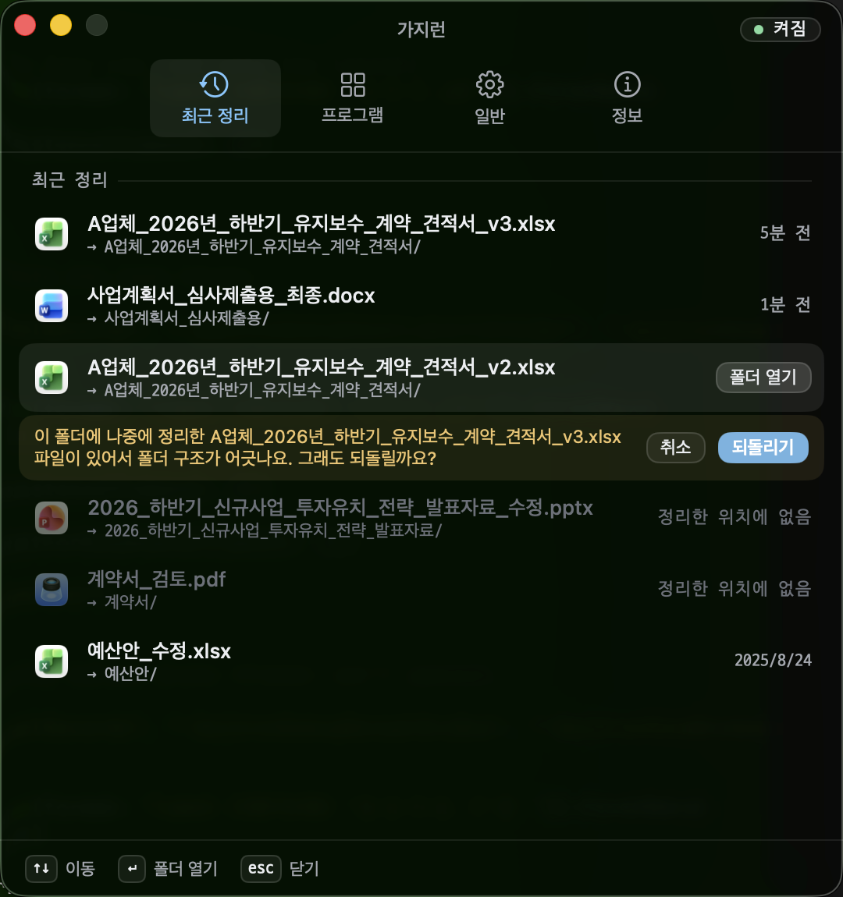</p>

<p>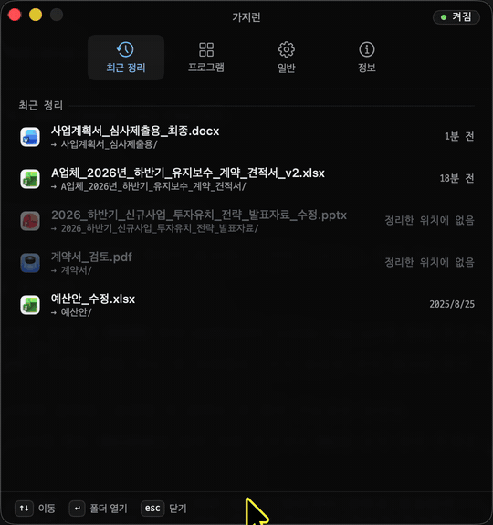</p>

</details>

<details>
<summary><b>어플리케이션 창 > 프로그램</b></summary>

<p>프로그램 실형 여부, 프로그램별 적용 제어</p>

<p>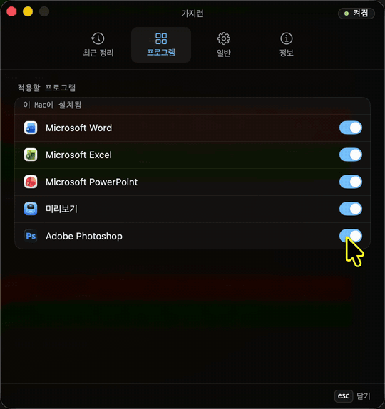</p>

</details>

<details>
<summary><b>어플리케이션 창 > 일반</b></summary>

<p>로그인시 자동 실행, 토스트 제어.</p>

<p>로그 확인.</p>

<p>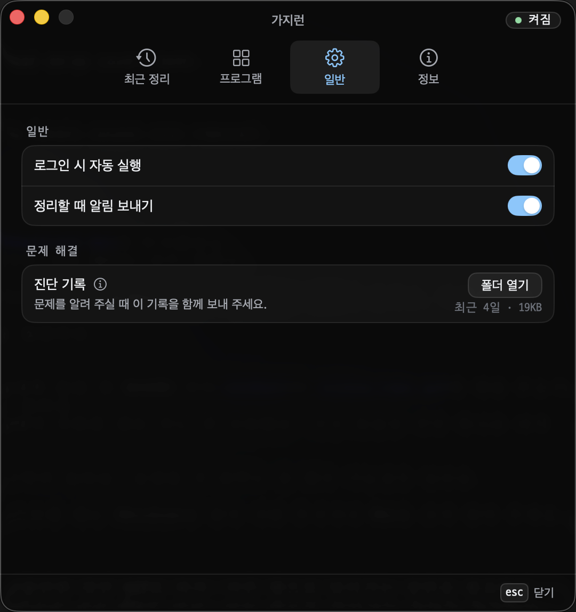</p>

</details>

<details>
<summary><b>어플리케이션 창 > 정보</b></summary>

<p>버전 정보. 문의하기.</p>

<p>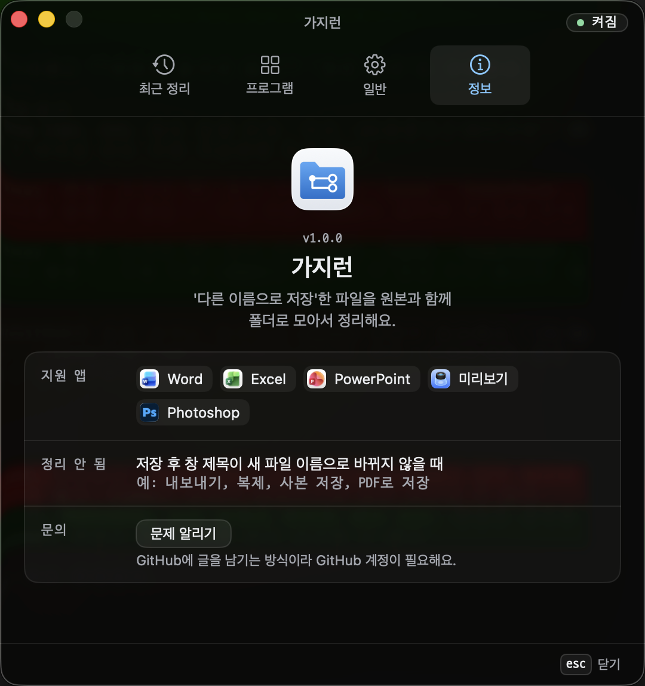</p>

</details>
